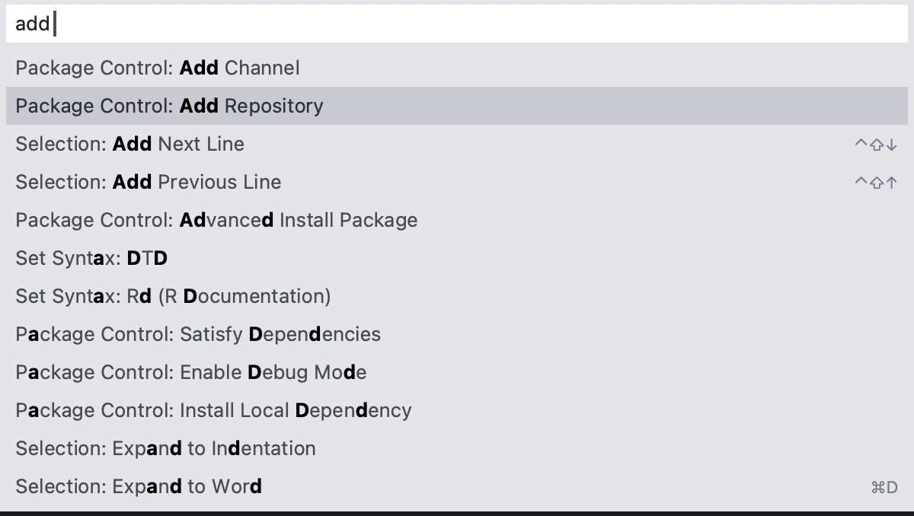
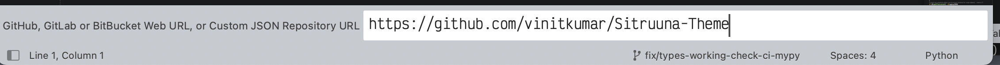

# Sitruuna Theme for Sublime

  

A beautiful dark theme based on the [Sitruuna Vim theme](https://github.com/eemed/sitruuna.vim) . Since no sublime version of the theme existed, I decided to write my own referring to the original vim theme. It's pretty close to the original but improvements and feedbacks are welcome.

## Installation Steps

There are couple of steps required to add these colorscheme:

- Press (CMD + shift + p on mac, CTRL + shift + p ), Add repository to the sublime package control. (`https://github.com/vinitkumar/Sitruuna-Theme`)

- Save and search for "Sitruuna" and you should find the theme.

## NOTE

A Jetbrains port of theme is also in progress since that's my IDE of choice and I would love to use same theme everywhere.

- Colorscheme: Sitruuna
- Font: Victor Mono
