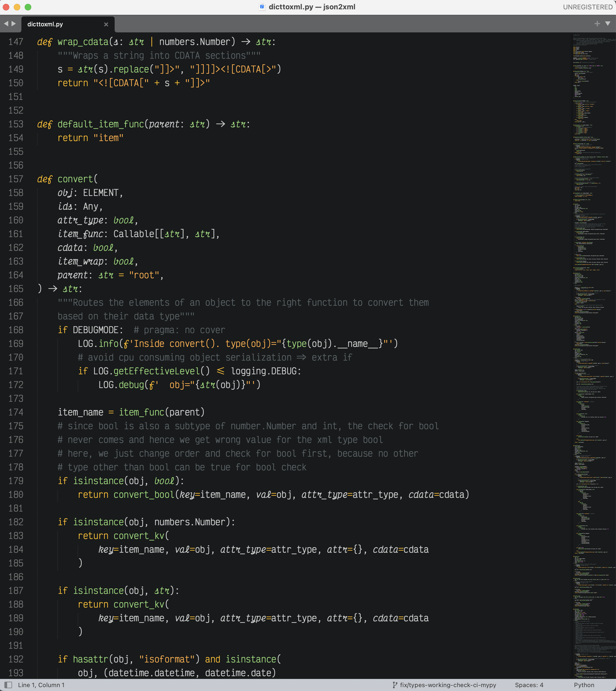

# Sitruuna Theme for Sublime

A beautiful dark theme based on the [Sitruuna Vim theme](https://github.com/eemed/sitruuna.vim) . Since no sublime version of the theme existed, I decided to write my own referring to the original vim theme. It's pretty close to the original but improvements and feedbacks are welcome.

## Screenshot

Following is the screenshot of this plugin in action. A Jetbrains port of theme is also in progress since that's my IDE of choice and I would love to use same theme everywhere.

- Colorscheme: Sitruuna
- Font: Victor Mono

